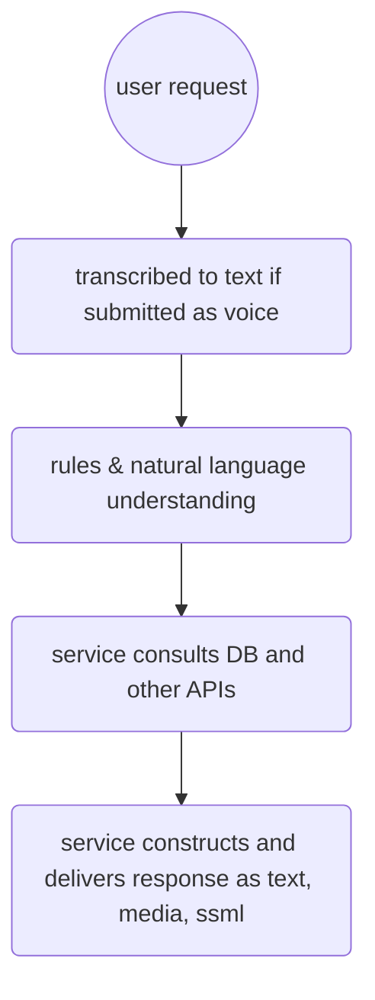

- User makes request
	- if written then submitted as text
	- if voice then transcribed to text prior to submission
- Service uses rules and natural language understanding to determine user's intent
- Service sends JSON to DB and  API endpoint via REST, Socket, WebHook
- Service receives response as text or media and delivers to user's device

# Visualization

Since conversations are stateless, that is interlocutors can jump between topics and ignore questions or refuse to give responses, drawing a tree structure which represents linear paths is not representative of real conversations.

Use graphs only to convey a high level overview.

