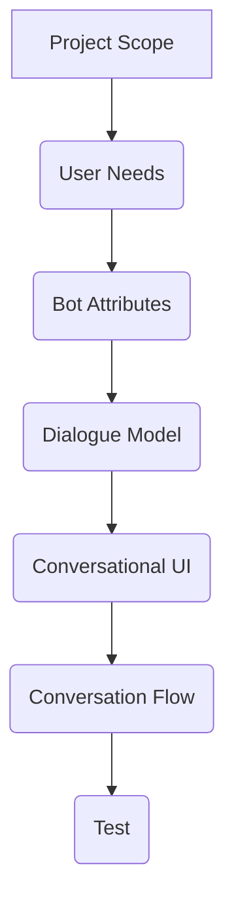

# Uses

Identify situations in which the conversation offers a benefit or improvement over what is already available.

- FAQs
- repetitive tasks

Offer a voice interface for instances when the user is unable or unwilling to interact with a screen.

- jogging
- carrying things

# User Journey

Focuses on the motivations and high vs low points as the user attempts to achieve their goal. Helps reveal opportunities to help the user achieve their goal in the most pleasant manner.

- goal
- situation
- context
- pain points

# Customer Journey

Focuses on the touch points the user encounters during their attempt at achieving their goal. Search for opportunities in which the assistant can automate or ease their routine tasks.

# Doodle

Draw the user going through the process of achieving their goal. 

# Experience Ideas

- perform a table read
- make intent cards
- back to back test
- wizord of oz method

## Intent Card

**Intent**
This is the request.
*on front of card*
intent : place order
rules & utterances : "I'm ready." , "What's on the menu?"

**Prompt**
This is the response.
*on back of card*
prompt : "We have a delicious peperoni pizza just out of the oven."

## Back to Back Test

- 2 researchers sitting back to back so to not influence the interaction with non verbal communication
- one is the user with intent
- the other is the bot with response

## Wizard of Oz Method

- pretend to be the device
- paper
- low fi prototype

# User Story

{who} {goal} {why}

{New hungry user} {who want to know what is on the menu} {to order food}.

# User Persona

- name
- behaviours
- demographics
- needs
- goals

# Bot Persona

- name
- behaviours
- demographics
- needs
- goals

This helps define the bot's personality.

# Personality

Consider types of questions users will ask.
Some will test your bot so have fun with it.

| user | bot |
| ---- | ---- |
| 42 | That's the answer to the ultimate question of life, the universe, and everything! |

# Prototype Flows

To visualize conversation flows you can use
- flowcharts
- spreadsheets

# Design Process

Begin by defining
- project scope

In relation to the bot define
- bot persona
- bot personality
- conversation stack
- prompts
- responses

In relation to the user define
- user journey
- conversational tasks
- micro moments
- happy path
- screen writing
- intent patterns

Develop the dialogue model based on
- intents
- slots

Design the conversational UI
- utterances
- prompts

Develop the conversation flow
- code
- APIs

