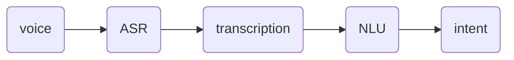
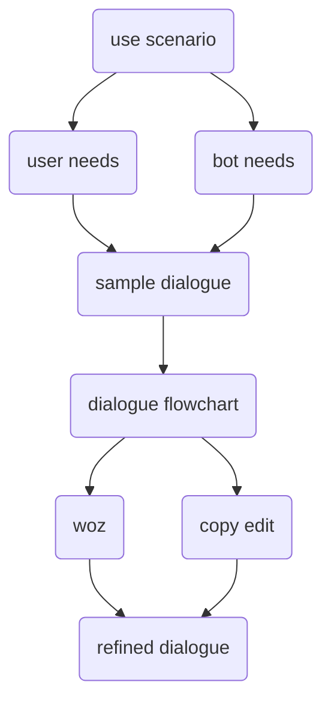

- make intents
- write replies
- deploy bot

# Workflow

Requirements
- tech available (feasibility)
- use cases, user journeys (problem to solve)
- users
- bot persona
Happy Flow
- happy path
Detailed Flow
- model training
- long tail
- exceptions
- repair

# Happy Path

# Scene

Describe the context

- location
- social
- temporal

# Needs

## User

goals
- wants to { }
- wants to know { }
mindset
- motivated by { }
- worries about { }
- expects { }
- feels { }
- assumptions

## Bot

powers
- can do
- can't do
- existing knowledge base
- can find out
responsibilities
- must ask { to decipher intent }
- must tell
- promotes
- discourages

