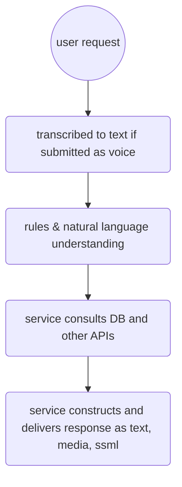

- User makes request
	- if written then submitted as text
	- if voice then transcribed to text prior to submission
- Service uses rules and natural language understanding to determine user's intent
- Service sends JSON to DB and  API endpoint via REST, Socket, WebHook
- Service receives response as text or media and delivers to user's device

